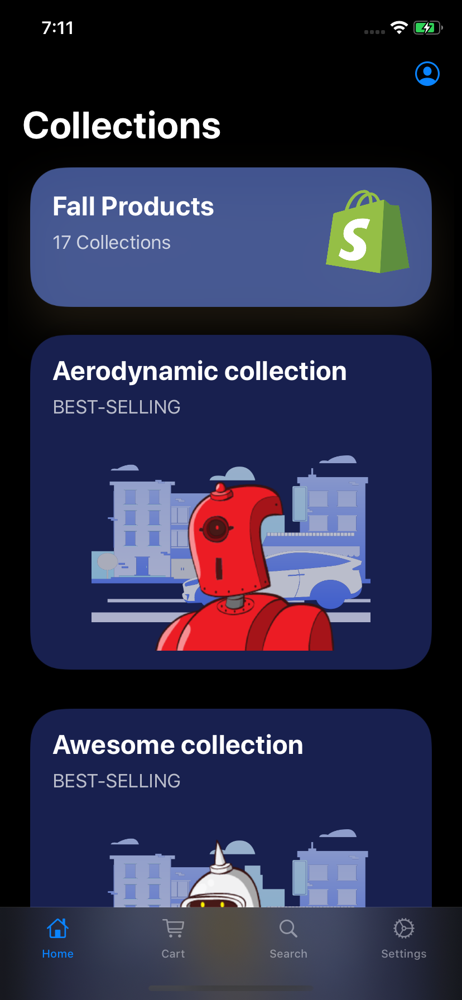
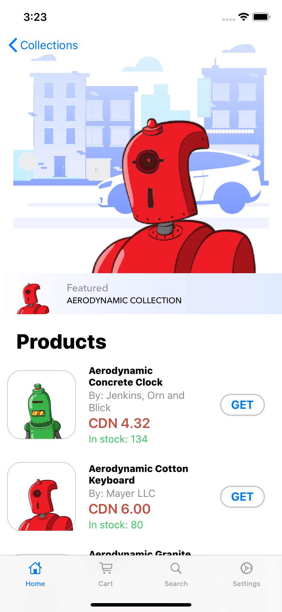

# ShopifyStore - iOS internship challenge for fall 2020 submission

This project submission is for the Mobile Developer (iOS) intern challenge at Shopify for Fall 2020

The project created is a native iOS mobile store that creates a shopping expereince from three given API’s from Shopify. 

# Features

## Collections Page

* <b>Header card:</b> displays amount of collections in the store
* <b>List of collection cards:</b> when selecting a specific collection, the user is navigated to a list of products that are apart of the selected collection

## Products Page

* <b>Parallax Banner:</b> displays information which describes the collection selected
* <b>List of products:</b> that belong to the collection (previously selected by the user)
* <b>Product card:</b> contains the following information: 
    * Name of product
    * Price
    * Image
    * Inventory remaining
    * Vendor of product
* <b>'GET' button:</b>, which allows users to add the selected product to their shopping cart
    
## Shopping Cart Page

* <b>Unique view:</b> when shopping cart contains 0 products
    * Lottie animation is displayed
    * Text description informs user that shopping cart is empty
* <b>Products Added:</b> the view organizes the products into a list
* <b>List of products:</b>, users can swipe to delete, or use the edit button to remove items
* <b>Checkout button:</b> displays the total cost of items in the shopping cart
    * When selected, the user will be navigated to checkout flow
    
## Checkout Flow

* <b>Option</b> to ship to multiple Shopify offices
* <b>Pricing details:</b>
    * Shipping cost
    * HST/GST
    * Subtotal
    * Total cost of Order
* <b>Toggle button:</b> to recieve email notification
* <b>Date picker</b> to display the date
* <b>Confirmation prompt:</b> recieves prompt when user submits order and shopping cart/checkout flow is cleared

# File Architecture - Model View ViewModel (MVVM)
This project is built using SwiftUI framework. 
 
This project uses the following third-party Swift packages and dependencies: 
* Alamofire: https://github.com/Alamofire/Alamofire
* SwiftyJSON: https://github.com/SwiftyJSON/SwiftyJSON
* Lottie: https://github.com/airbnb/lottie-ios

