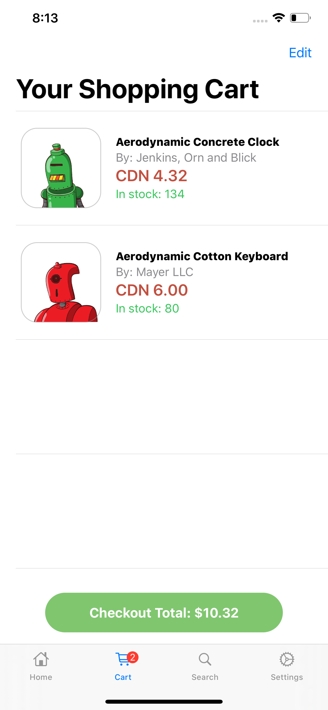

# ShopifyStore - iOS
## By: Gio Lucero
<p float="left" align="center">


</p>

This project submission is for the Mobile Developer (iOS) intern challenge at Shopify in Ottawa and Toronto for fall 2020. This app replicates an e-commerce store by displaying data from three given API’s, using <b>Swift</b> and <b>SwiftUI</b>.
 
This project uses the following third-party Swift packages and dependencies: 
* <b>Alamofire</b> - for HTTP Requests @ https://github.com/Alamofire/Alamofire
* <b>SwiftyJSON</b> - for parsing data  @ https://github.com/SwiftyJSON/SwiftyJSON
* <b>Lottie</b> - to render animations natively @ https://github.com/airbnb/lottie-ios

# Features
This project uses three different API's, from which we collect our data. The first is the <b>custom collection API</b> that provides us with the collection data. <br/>

This API is represented as:

```
https://shopicruit.myshopify.com/admin/custom_collections.json
```
The second API used in this project is the <b>products API</b>, which provides us with the data on every product of every collection. <br/>

The API is represented as: 

```
https://shopicruit.myshopify.com/admin/products.json
```
The third API used in this project is the <b>collects API</b>, which allows us to group products to their corresponding collection. <br/>

The API is represented as:

```
https://shopicruit.myshopify.com/admin/collects.json
```

# File Architecture - MVVM
This project is built with <b>SwiftUI</b>, Apple’s new user interface toolkit using <b>declarative syntax</b> and the <b>Combine Framework</b> (API for processing values over time).<br/>

The design structure used in this app is Model, View, View Model (MVVM)
* <b>NetworkManager:</b> handles all networking and API related code
* <b>Extension:</b> handles the extensions made to our Swift files
* <b>Models:</b>  includes models that parse API results
* <b>ViewModels:</b> includes files that reference data objects from the models so that they may be managed and presented 
* <b>Assets.xcassets:</b> include additional images used in the project
* <b>TabBar:</b> Our root view, which include all views that can be selected through the tab bar
 
 # Code Structure
 # Network Manager
 All API related code can be found within our NetworkManger class, which consists of a getData function to fetch data through an Alamofire API call. The parameters set within this function allows us to pass in any of the three API’s used in the project. All JSON parsing is done within each corresponding model. <br/>
 
 Here is an example:
 
 ```swift
/// API Call - return the JSON data from API 
public func getCardData(withURL url: String, andParameters parametersTemp: Parameters = Parameters(), completion: @escaping (JSON) -> Void) {
        
        /// Parameters being set to perform the GET request
        
        var parameters = parametersTemp
        
        /// Using the access token to access the API
        parameters["access_token"] = NetworkManager.accessToken
        
        /// Making the GET request (default in Alamofire)
        let request = AF.request(url, parameters: parameters)
        request.responseJSON { response in
            /// DispatchQueue executes a line of code in the main thread (primary source of execution)
            DispatchQueue.main.async {
                /// once the request is executed, we want to let it run till a json response is found
                if let json = response.value {
                    print(json)
                    completion(JSON(json))
                    /// if the json is not found, return an error
                } else if let error = response.error {
                    completion(JSON(error.localizedDescription))
                }
            }
        }
    }
 ```
 
# Models
Each model filters the data we want from the API. To do so, each model contains two initializers, (1) to initialize a set of variables for our data, and (2) to parse the JSON  6                               , using <b>SwiftyJSON</b>. <br/>

Here is an example:

```swift
/// This initialization allows us to fetch the elements from our Product model from the products url JSON
    init(withJSON json: JSON) {
        self.init(
            /// Storing the value from the products JSON into the elements of the product model
            withId: json["id"].intValue,
            withtitle: json["title"].stringValue,
            andDescription: json["body_html"].stringValue,
            andVendorName: json["vendor"].stringValue,
            andPrice: json["variants"][0]["price"].doubleValue,
            andQuantity: json["variants"][0]["inventory_quantity"].intValue,
            andImage: UIImage(fromUrl: json["image"]["src"].stringValue)
        )
    }
```
 
# View Models
Each view model handles the data of their respective views. Each also holds a function to make an API call, and pass it into the NetworkManager, which handles the HTTP requests. I have selected which key to access in the JSON through the map function. <br/>

Here is an example:

```swift
// Not only gets the data from backend, but also parses it to what we want.
    public func getProductData(withProductIds productIds: [Int], completion: @escaping ([ProductCard]) -> Void) {
        
        
        let productIdsStringConversion: String = productIds.map { String($0) }.joined(separator: ",")
        
        let parameter: Parameters = [
            "ids": productIdsStringConversion
        ]
        
        NetworkManager.shared.getCardData(withURL: NetworkManager.productURL, andParameters: parameter) { productCardsJSON in
                
            let productCards = productCardsJSON["products"].arrayValue.map {
                // $0 - accesses the key elemenent
                ProductCard(withJSON: $0)
            }
            completion(productCards)
        }
    }
```

# Views
## Tab Bar
This app has three main views, which the user can select through the tab bar. Our root view displays a list of collection cards that house the corresponding products of the same collection_id.
<br/>


## Shopping Cart
The second view in the tab bar is the shopping cart. When empty, the view will display a lottie animation and a text prompting the user to add items to the cart.


...

Once items have been added, the cart will turn into a list that contains the items that have been added. Once items have been added to the list, there is an edit button that will allow users to remove items from the list. You can also swipe to remove items from the list.


...

## Checkout View
At the bottom of the view, a button will present the total cost of the items before shipping and tax. If the button is clicked, the user will be directed to a checkout view.


...

The checkout view displays the data in a form layout in SwiftUI. This view will display the shipping locations, the price breakdown, and finally allow users to submit their orders. Each pricing detail has been calculated in seperate functions. 

## Search Bar
The second view that can be selected in the tab bar is the search tab. This view stores the list of collection names, and upon accessing the searched name, it will direct the user to the given collection view with the list of products.
<br/>

…

Finally, we have a settings tab. This is an additional feature to the app, to further emulate the e-commerce experience! 
<br/>

...

# Additional Features
## Activity Indicator
While the data is being loaded for each view, I have added an activity indicator, which displays a loading animation. Once the data has successfully loaded, the data will be displayed on the screen. 

```swift
/// displays loading animation while data is being loaded
struct ActivityIndicator: UIViewRepresentable {

    @Binding var isAnimating: Bool
    let style: UIActivityIndicatorView.Style

    func makeUIView(context: UIViewRepresentableContext<ActivityIndicator>) -> UIActivityIndicatorView {
        return UIActivityIndicatorView(style: style)
    }

    func updateUIView(_ uiView: UIActivityIndicatorView, context: UIViewRepresentableContext<ActivityIndicator>) {
        isAnimating ? uiView.startAnimating() : uiView.stopAnimating()
    }
}
```

… (view)

## Parallax Effect
This app also features the parallax effect within our products list page.

```swift
GeometryReader { geometry in
                VStack {
                    /// Stretches image based on the position of the scroll
                    if geometry.frame(in: .global).minY <= 0 {
                        Image("Featured-Card-Bg")
                            .resizable()
                            .aspectRatio(contentMode: .fill)
                            .frame(width: geometry.size.width, height: geometry.size.height + geometry.frame(in: .global).minY)
                            .clipped()
                            .offset(y: -geometry.frame(in: .global).minY)
                    } else {
                        Image("Featured-Card-Bg")
                            .resizable()
                            .aspectRatio(contentMode: .fill)
                            .frame(width: geometry.size.width, height: geometry.size.height + geometry.frame(in: .global).minY)
                            .clipped()
                            .offset(y: -geometry.frame(in: .global).minY)
                    }
                }
            }
```

… (view)


 

