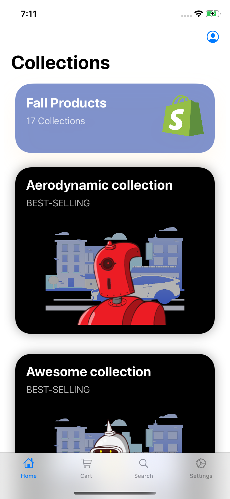

# ShopifyStore - iOS internship challenge for fall 2020 submission
## By: Gio Lucero
<p float="left" align="center">



</p>

This project submission is for the Mobile Developer (iOS) intern challenge at Shopify in Ottawa and Toronto for fall 2020. This app replicates an e-commerce store by displaying data from three given API’s, using <b>Swift</b> and <b>SwiftUI</b>.
 
This project uses the following third-party Swift packages and dependencies: 
* https://github.com/Alamofire/Alamofire
* SwiftyJSON: https://github.com/SwiftyJSON/SwiftyJSON
* Lottie: https://github.com/airbnb/lottie-ios

# Features

```

# File Architecture - Model View ViewModel (MVVM)
This project is built using SwiftUIf ramework. 


# Views
## Tab Bar
This app has three main views, which the user can select from through the tab bar. Our root view displays a list of collection cards that house the corresponding products of the same collection_id.
<br/>


## Shopping Cart
The second view in the tab bar is the shopping cart. When empty, the view will display a lottie animation and a text prompting the user to add items to the cart.


...

Once items have been added, the cart will turn into a list that contains the items that have been added. Once items have been added to the list, there is an edit button that will allow users to remove items from the list. You can also swipe to remove items from the list.


...

## Checkout View
At the bottom of the view, a button will present the total cost of the items before shipping and tax. If the button is clicked, the user will be directed to a checkout view.


...

The checkout view displays the data in a form layout in SwiftUI. This view will display the shipping locations, the price breakdown, and finally allow users to submit their orders. Each pricing detail has been calculated in seperate functions. Once the user submits their order, the shopping cart will be clear out all the items from the list. 

## Search Bar
The second view that can be selected in the tab bar is the search tab. This view stores the list of collection names, and upon accessing the searched name, it will direct the user to the given collection view with the list of products.
<br/>

…

Finally, we have a settings tab. This is an additional feature to the app, to further emulate the e-commerce experience! 
<br/>

...


… (view)

## Animations 
This project uses a lottie animation, which is displayed when the shopping cart is empty. The robot animation adds to theme of the project!


... (view)


 

